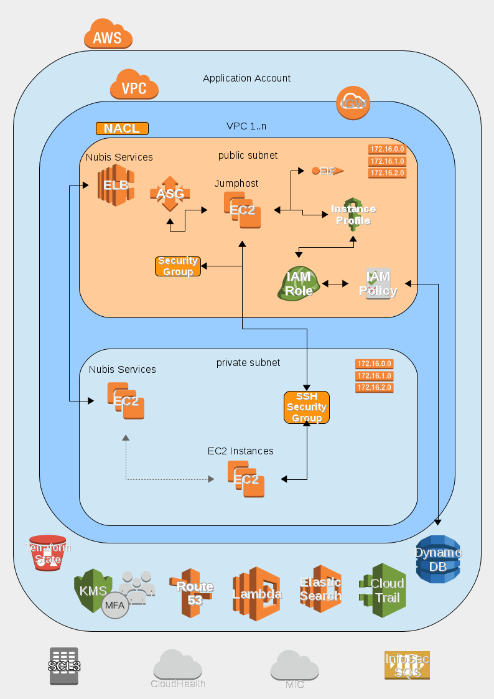

# nubis-jumphost

[](https://github.com/nubisproject/nubis-jumphost/releases)
[](https://travis-ci.org/nubisproject/nubis-jumphost)
[](https://github.com/nubisproject/nubis-jumphost/issues)

## Jumphost Deployment
The Jumphost project is designed to be deployed into a standard Nubis Account. It takes advantage of the standard deployment found [here](https://github.com/nubisproject/nubis-docs/blob/master/DEPLOYMENT_OVERVIEW.md).

The jumphost can be optionally deployed and provides a way for users to access EC2 instances over SSH. Once deployed the Jumphost instance has has the permissions necessary to allow users to SSH into instances deployed into either the Public or Private subnets. These permissions are provided by, and enforced by, Security Groups. There is only one Jumphost deployed per VPC which allows access to instances deployed into any subnet within that VPC. The Jumphost is deployed into an Auto Scaling group to provide resiliency, however it is not designed for HA (only a single host is deployed).

### Deployment Diagram


**NOTE**: The line colors are representative and are for readability only. They are not intended to indicate any underlying protocol or specific communication details.

### Deployment Notes
The Nubis Jumphost deployment consists of:
 - EC2 Instance in the Public Subnet in an Autoscaling Group
 - Elastic IP providing a stable IP for whitelisting and firewalling
 - Attachment to account SSH Security group for access control
 - IAM Role and Policy for accessing boot secrets

### Deployment Resources
Details for the deployment including; naming conventions, relationships, permissions, etcetera, can be found in the [Terraform template](nubis/terraform/main.tf) used for deployment. Links to specific resources can be found in the following table.

|Resource Type|Resource Title|Code Location|
|-------------|--------------|-------------|
|atlas_artifact|nubis-jumphost|[nubis/terraform/main.tf#6](nubis/terraform/main.tf#6)|
|aws_eip|jumphost|[nubis/terraform/main.tf#19](nubis/terraform/main.tf#19)|
|aws_route53_record|ui|[nubis/terraform/main.tf#25](nubis/terraform/main.tf#25)|
|aws_security_group|jumphost|[nubis/terraform/main.tf#34](nubis/terraform/main.tf#34)|
|aws_iam_instance_profile|jumphost|[nubis/terraform/main.tf#73](nubis/terraform/main.tf#73)|
|aws_iam_role|jumphost|[nubis/terraform/main.tf#87](nubis/terraform/main.tf#87)|
|aws_iam_role_policy|jumphost|[nubis/terraform/main.tf#110](nubis/terraform/main.tf#110)|
|aws_launch_configuration|jumphost|[nubis/terraform/main.tf#132](nubis/terraform/main.tf#132)|
|aws_autoscaling_group|jumphost|[nubis/terraform/main.tf#168](nubis/terraform/main.tf#168)|

#### How to build project
1. Build the AMI
    ```bash
    $ vi ./nubis/builder/project.json
    $ nubis-builder build
    ```

2. Edit the terraform.tfvars file
    ```bash
    $ cp ./nubis/terraform/terraform.tfvars-dist ./nubis/terraform/terraform.tfvars
    $ vi nubis/terraform.tfvars
    ```

3. Deploy using Terraform
    ```bash
    $ terraform plan
    $ terraform apply
    ```

#### Notes
You need to init git submodules
```bash
git clone git://github.com/limed/nubis-jumphost.git
git submodule update --init --recursive
```
